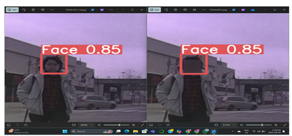
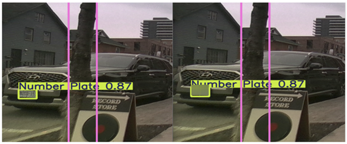
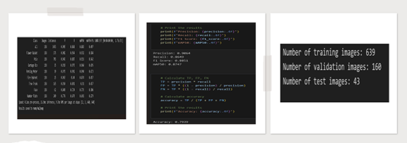
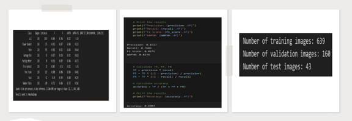
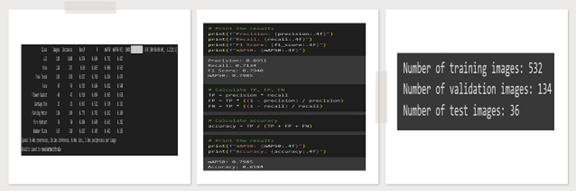
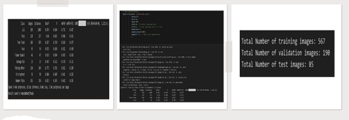

# Personal Information Blurring — YOLOv5 & YOLOv9
### Humber College AI Capstone | Industry Partner: Kevares Inc., Canada

---

## 📌 Project Overview
Real-time system to automatically detect and blur personal 
information — faces and license plates — captured by 
forward-facing cameras on autonomous sidewalk inspection robots.

Built as part of the AI & Machine Learning Graduate Certificate 
Capstone at Humber College in partnership with Kevares Inc., Canada.

---

## 🎯 Problem Statement
- **Purpose**: Protect public privacy during sidewalk inspections 
  performed by autonomous robots
- **Scope**: Detect and blur faces and license plates in real-time 
  from live robot camera video feeds
- **Partner**: Kevares Inc. — Canadian robotics company operating 
  autonomous robots for municipal sidewalk inspections

---

## 📸 Real-World Blurring Output — YOLOv5l (Best Model)

Face detected and blurred from sidewalk robot camera:

License plate detected and blurred in real street footage:

---

## 🛠 What We Built
- Annotated dataset using **CVAT** (Computer Vision Annotation Tool)
- Trained and compared **YOLOv5s, YOLOv5l, YOLOv9c** models
- Applied blurring filters to anonymize detected regions in 
  real-time video feeds from autonomous robots
- Evaluated all models using Precision, Recall, F1 Score, 
  mAP50 and Accuracy

---

## 📊 Model Results

| Model | Precision | Recall | F1 Score | mAP50 | Accuracy |
|-------|-----------|--------|----------|-------|----------|
| YOLOv5s | 87.3% | 76.8% | 81.7% | 82.8% | 69.1% |
| **YOLOv5l ⭐** | **90.6%** | **86.5%** | **88.5%** | **87.5%** | **79.4%** |
| YOLOv9c | 89.5% | 71.3% | 79.4% | 79.9% | 65.8% |
| YOLOv9c (Tuned) | 87.2% | 68.4% | 76.7% | 75.1% | 62.2% |

**⭐ Best Model: YOLOv5l — 200 epochs · Batch 24 · Image 640×640**

---

## 📈 Model Result Screenshots

### YOLOv5l — Best Model (Precision 90.6%)

### YOLOv5s — Baseline

### YOLOv9c

### YOLOv9c — Hypertuned

---

## 💡 Key Learnings
- YOLOv5l outperformed newer YOLOv9c — more epochs and 
  larger batch size improved recall significantly
- Hyperparameter tuning alone does not guarantee better results
- Real-world data annotation using CVAT was the most 
  time-intensive step
- Model selection matters more than architecture version alone

---

## 🔧 Tech Stack

| Category | Tools |
|---|---|
| Language | Python |
| Models | YOLOv5s · YOLOv5l · YOLOv9c |
| Annotation | CVAT (Computer Vision Annotation Tool) |
| Training | Google Colab (T4 GPU) |
| Libraries | OpenCV · TensorFlow · NumPy · Pandas |
| Methodology | Agile · Iterative Development |

---

## 👥 Team
Capstone team of 5 students — Humber College
AI & Machine Learning Graduate Certificate Program (2024)
Industry Sponsor: **Kevares Inc.**, Oshawa, Ontario, Canada

---

## 📫 Connect
- 💼 [LinkedIn](https://www.linkedin.com/in/hitakshikathiriya-3088a32ba)
- 📧 hitakshikathiriya123@gmail.com
